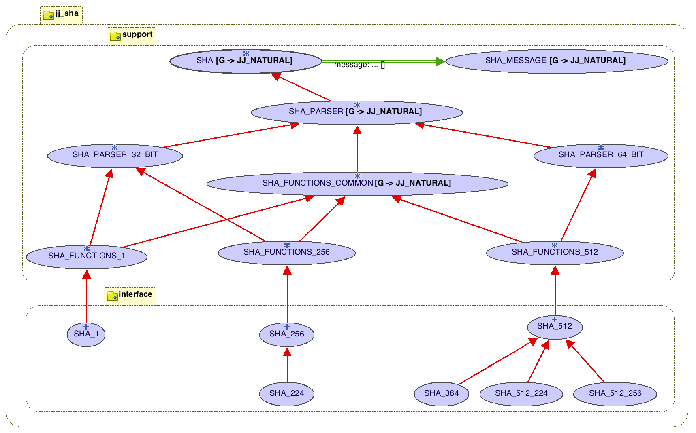

# jj_sha
###An Eiffel implementation of Secure Hash Algorithms

This repository contains classes for calculating various SHA hashes, conforming to [FIPS Pub 180-4 (Mar 2012)](./docs/FIPS PUB 180-4 (Mar 2012).pdf).  All the neccessary classes are in the [classes](./classes) directory.  To use the library, include [jj_sha.ecf file](./classes/jj_sha.ecf) in a project.  

This library provides classes for calculating SHA-1, SHA-256, SHA-512, SHA-224, SHA-384, SHA-512/256, and SHA-256/224 hashes (i.e. a message digest) from string or file input.  The [interface classes](./classes/interface) classes, shown below the [support classes](./classes/support) in the diagram below include:  

- [SHA-1](./classes/interface/32-bit/sha_1.e) - produces a 160-bit [SHA\_1\_DIGEST](), implemented as 32-bit words


###Example Use

The intended usage pattern is to create an object of the type corresponding to the desired encryption (i.e. SHA-1, SHA-256, etc.), set the string or file message to be hashed, and then query the parser for the digest.

```			
local
	parser: SHA_1
	d, d2: SHA_DIGEST_1
do
	create parser	
	parser.set_with_string ("The red fox jumps over the blue dog")
	d := parser.digest
	parser.set_with_string ("the red fox jumps over the blue dog")
	d2 := parser.digest
	if d1 ~ d2 then
		io.put_string ("The two input strings were the same. %N")
	else
		io.put_string ("The two input strings were NOT the same. %N")
		io.put_string ("digest 1 = " + d.as_hex_string + "%N")
		io.put_string ("digest 2 = " + d2.as_hex_string + "%N")
	end
end
```		
	
The output of the above code is: 

```
	The two input strings were NOT the same.
		digest 1 = 0fec050f 02cd6201 e2ef871e cf8f9d94 c1dab7ae
		digest 2 = faf08572 98136eff 6c72af2f d0b6a9bf c76235a0
```

Note that a small change, the first letter of the input changed to lower case, produced a large change in the computed digest.


It depends on the [JJ_NATURAL classes](http://github.com/boxer41a/jj_naturals).  Using JJ_NATURAL reduced the number of classes required for this project and prevented code duplication.

To use the example ecf files, checkout the library to a location identified by the envirnment variable "JJ_GITHUB".



